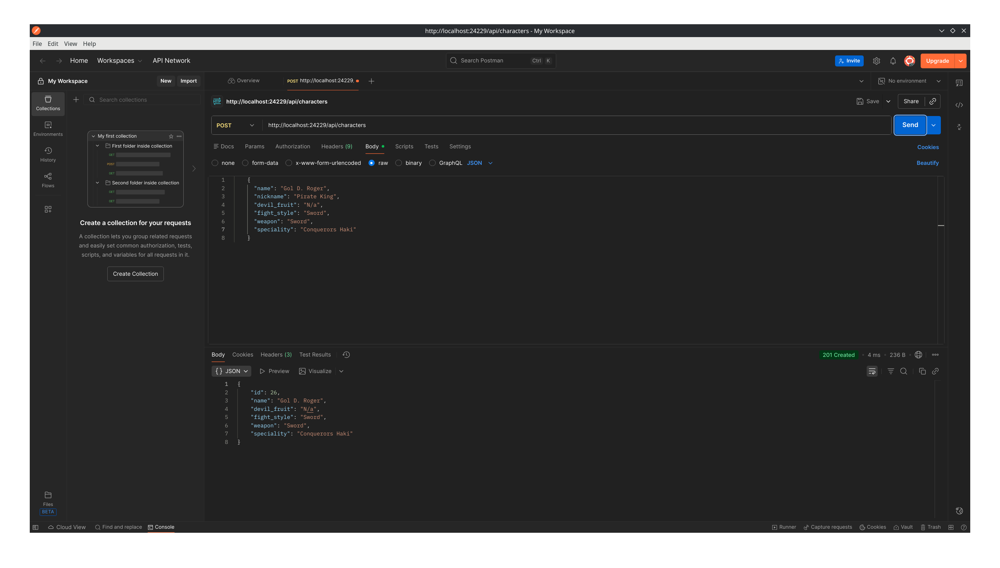
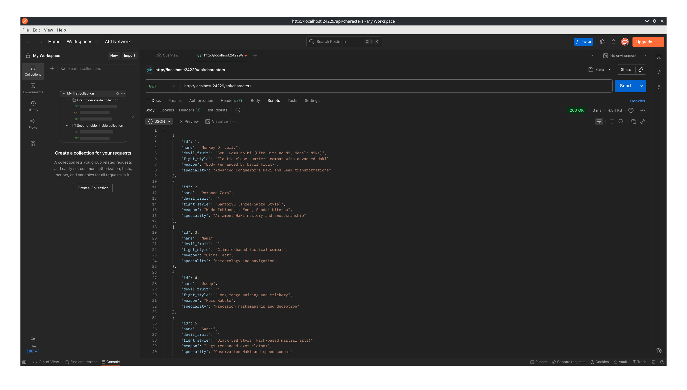
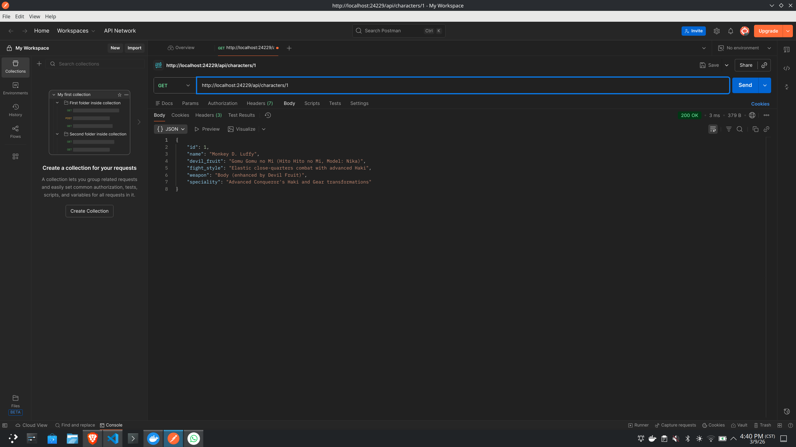

# go-http

API HTTP RESTful construida en Go (sin frameworks externos) para gestionar personajes de One Piece. Los datos se persisten en un archivo JSON local y el servidor corre dentro de Docker.

---

## Estructura del proyecto

```
go-http/
├── data/
│   └── onepiece.json        # Archivo JSON usado como base de datos
├── handlers/
│   └── handler_character.go # Métodos HTTP del controlador
├── models/
│   └── item.go              # Struct del modelo Character
├── utils/
│   └── items.go             # Helper WriteJSON
├── main.go                  # Punto de entrada y registro de rutas
├── Dockerfile
└── docker-compose.yml
```

---

## Requisitos

- [Docker](https://www.docker.com/) y Docker Compose

---

## Cómo correr el servidor

```bash
docker compose build --no-cache
docker compose up
```

El servidor estará disponible en `http://localhost:24229`.

---

## Modelo de personaje

| Campo       | Tipo   | Clave JSON    | Requerido |
|-------------|--------|---------------|-----------|
| ID          | int    | `id`          | automático |
| Nombre      | string | `name`        | sí        |
| Fruta       | string | `devil_fruit` | no        |
| Estilo      | string | `fight_style` | sí        |
| Arma        | string | `weapon`      | sí        |
| Especialidad| string | `speciality`  | sí        |

---

## Endpoints

> Todas las rutas `/api/items` son alias de `/api/characters` y se comportan de forma idéntica.

### Health Check

```
GET /api/ping
```

**Respuesta**
```json
{ "message": "pong" }
```

---

### Obtener todos los personajes

```
GET /api/characters
GET /api/items
```

Soporta parámetros opcionales de filtrado (combinables entre sí):

| Parámetro     | Descripción                                  |
|---------------|----------------------------------------------|
| `id`          | Filtrar por ID exacto                        |
| `name`        | Filtrar por nombre exacto (sin distinción de mayúsculas) |
| `devil_fruit` | Filtrar por fruta del diablo (coincidencia parcial) |
| `weapon`      | Filtrar por arma (coincidencia parcial)      |
| `speciality`  | Filtrar por especialidad (coincidencia parcial) |
| `fight_style` | Filtrar por estilo de pelea (coincidencia parcial) |

**Ejemplos**
```
GET /api/characters
GET /api/characters?name=Zoro
GET /api/characters?weapon=sword&devil_fruit=mera
GET /api/items?fight_style=kick
```

---

### Obtener personaje por ID

```
GET /api/characters/{id}
GET /api/items/{id}
```

**Respuesta `200`**
```json
{
  "id": 1,
  "name": "Monkey D. Luffy",
  "devil_fruit": "Gomu Gomu no Mi",
  "fight_style": "Elastic close-quarters combat",
  "weapon": "Body",
  "speciality": "Gear transformations"
}
```

**Respuesta `404`**
```json
{ "error": "Character not found" }
```

---

### Agregar personaje

```
POST /api/characters
POST /api/items
Content-Type: application/json
```

**Body**
```json
{
  "name": "Boa Hancock",
  "devil_fruit": "Mero Mero no Mi",
  "fight_style": "Kick-based martial arts",
  "weapon": "Body",
  "speciality": "Petrification via love"
}
```

**Respuesta `201`** — devuelve el personaje creado con su `id` generado.

---

### Actualizar personaje

```
PUT /api/characters/{id}
PUT /api/items/{id}
Content-Type: application/json
```

**Body** — mismos campos que POST.

**Respuesta `200`** — devuelve el personaje actualizado.  
**Respuesta `404`** — si el ID no existe.

---

### Eliminar personaje

```
DELETE /api/characters/{id}
DELETE /api/items/{id}
```

**Respuesta `200`**
```json
{ "message": "Character deleted" }
```

---

## Respuestas de error

Todos los errores siguen el mismo formato:

```json
{ "error": "<descripción>" }
```

| Estado | Significado                                      |
|--------|--------------------------------------------------|
| 400    | Entrada inválida o campos requeridos faltantes   |
| 404    | Personaje no encontrado                          |
| 405    | Método no permitido                              |

---

## Evidencia

### Crear personaje



### Obtener todos los personajes



### Obtener un personaje


